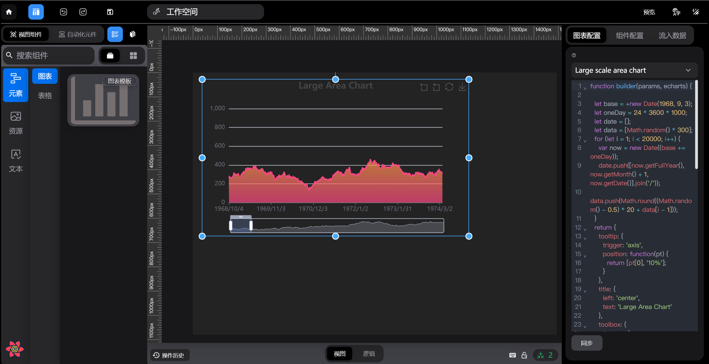
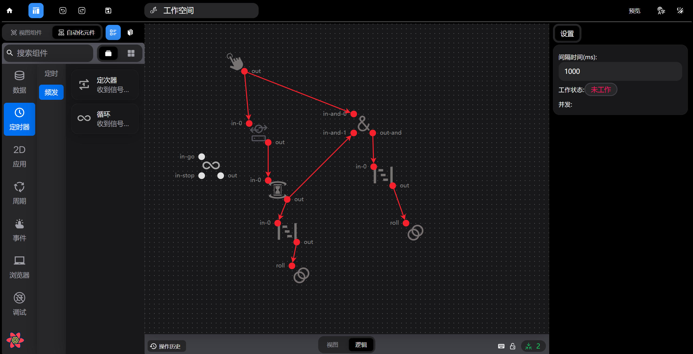

0：这是一个开箱即用的低代码项目
旨在建立一个 headlessui 的低代码平台



## 视图组件的注册

- 视图组件需要注册元素 signalViewNode
- 视图组件需要订阅更新 useAutoSubscription

```tsx
import { ATable } from "../comp/ATable";
import { getWCache } from "../panel/data";
import { pix_Table } from "../store/slice/nodeSlice";
import { signalViewNode } from "./baseViewNode";

export const TableTemplate = () => {
  const table = signalViewNode(pix_Table);
  table.createElement((_, { id }) => {
    return (
      <div
        style={{
          height: "100%",
          width: "100%",
        }}
      >
        <ATable id={id}></ATable>
      </div>
    );
  });
};
//声明完组件后需要去templateMain下注册组件
export const templateMain = () => {
  TableTemplate();
};

//订阅更新
useAutoSubscription(cid).render((value) => {
  //每当视图组件接收到逻辑元件的信号，则执行
});
```

## 如过组件不消费则不执行其输出

- 0:注册右侧菜单 （signalLogicNode）
- 1:所有逻辑节点输入端获取的 config 是上一节点的配置信息，而输出节点可以获取本节点配置信息

```tsx
import { signalLogicNode } from "../base.ts";
import { logic_Ring_get } from "../../store/slice/nodeSlice.ts";
import ring from "../../assets/widgetIcon/icon-park--cross-ring-two.svg";
import { of, interval, takeWhile, defer, tap } from "rxjs";
import { MUST_FORCE_STOP_SE } from "../../contant";
import { createSingleInstance } from "../../comp/createSingleInstance.ts";
import { getSyncTimeIntConfig } from "../../Setting/form/logic/timer/timeConfig.tsx";
import { ITimerConfigInfo } from "./logicConfigMap.ts";

const intTimer = () => {
  const timer = new Map<string, boolean>();
  return {
    timer,
  };
};

export const getInitTimer = createSingleInstance(intTimer);
//循环器
export const timeInter = () => {
  const TimeInter = signalLogicNode<
    { timerConfigInfo: ITimerConfigInfo },
    unknown,
    unknown
  >({
    id: logic_Ring_get,
    type: "timeInter",
    src: ring,
    tips: "收到信号后循环发出信号,直到stop端口收到信号止",
    name: "循环",
  });

  TimeInter.signalIn("in-go", (value) => {
    getInitTimer().timer.set(value.id, true);
    getSyncTimeIntConfig().subject.next({
      status: true,
    });
    return of(value?.pre);
  });

  TimeInter.signalIn("in-stop", (value) => {
    return defer(() => of(MUST_FORCE_STOP_SE)).pipe(
      tap(() => {
        getInitTimer().timer.set(value.id, false);
        getSyncTimeIntConfig().subject.next({
          status: false,
        });
      })
    );
  });

  TimeInter.signalOut("out", (value) => {
    return interval(value.config.timerConfigInfo.time || 1000).pipe(
      takeWhile(() => {
        return (
          !!getInitTimer().timer.get(value.id) &&
          value?.pre !== MUST_FORCE_STOP_SE
        );
      })
    );
  });
};
```

- 注册配置项 (signalLogicNodeAttrConfig)

```tsx
export const remoteGetConfig = () => {
  //DEFAULT_LOGIC_PANEL_CONFIG 表示点击空白面板
  //参数 logic_D_get 就是组件注册的id
  const config = signalLogicNodeAttrConfig(logic_D_get);
  //nodeInfo 的target 是数组，表面 允许多选
  config.setConfigEle((nodeInfo) => {
    if (nodeInfo.target.length > 0) {
      return <>xxx</>;
    }
  });
};
```

- 开启逻辑路径(useSignalMsg)

```tsx
export const DefaultLogicConfig = () => {
  //signalLogicNodeAttrConfig 是注册 组件 配置项组件
  //
  const config = signalLogicNodeAttrConfig("DEFAULT_LOGIC_PANEL_CONFIG");
  //setConfigEle 返回一个JSX.Element，用于插入组件
  config.setConfigEle(() => {
    const logicState = useSelector((state: { logicSlice: ILs }) => {
      return state.logicSlice;
    });

    //他会寻找此点存在于逻辑图上的路径，从而执行逻辑节点上的任务
    const { go } = useSignalMsg(Object.keys(logicState.logicNodes)[0]);
    const handleClick = () => {
      go();
    };

    return <div onClick={handleClick}>333333</div>;
  });
};
```
